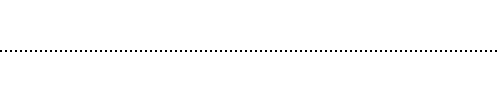
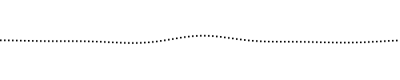
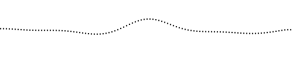
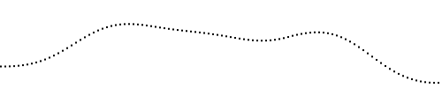
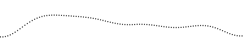
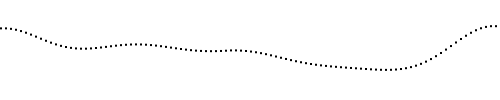

# wave.js
### A simple module to simulate dynamic waves using the 1-dimensional wave PDE
[usage](#usage) | [settings](#settings) | [demos](#demos) | [implementation](#implementation)

## Usage
You can create a wave like so:
```javascript
var w = wave();
```
Now you have a wave with some default settings. Let's explicitly pass in the number of samples the wave is made of.

```javascript
var w = wave({
    numSamples: 100
});
```

Cool! Now render the wave. Since the width of the wave spans 0 to 1 and the height of the wave spans -1 to 1, we'll need to translate these into canvas coordinates. Let's make it so that we just draw a dot at each sample.

```javascript
var canvas = document.getElementById('#wave-canvas');
var context = canvas.getContext('2d');
var unitX = canvas.width / 100;
for (var i = 0; i < 100; i++) {
    // value between -1 and 1, where 0 is the neutral wave level
    var waveHeight = w.height(i);

    // draw a 2x2-pixel square at the wave
    context.fillRect(
        i * unitX,
        canvas.height / 2 - (canvas.height / 2) * waveHeight,
        2,
        2
    );
}
```

Here's the result:



Not very exciting, huh? Let's give it a little splash and turbulence and render it again.

```javascript
// x [0, 1], y [-1, 1], strength (turbulence multiplier)
w.splash(0.5, 0.5, 1);
w.churn(0.5, 0.5, 1);
```

The above should create a splash upwards in the middle of the wave, and also general turbulence ("churn") centered at the same location.



Now let the wave propagate by advancing it (with a delta time) and re-rendering it.
```javascript
w.tick(1);
```





The next snapshots are taken after fast-forwarding 10 ticks after each previous snapshot. Pro tip: it creates a smoother transition to call `w.tick(1)` than to make one call to `w.tick(10)`.

```
for (var i = 0; i < 10; i++) {
    w.tick(1);
}
```








That's pretty much it! Take a look at some [demos](#demos) for inspiration, and refer to the [complete list of settings](#settings) to customize your wave.

## Settings
When wave is invoked with no arguments, the default settings are used. But you can manually specify the settings to customize the behavior of the wave.

| Setting | Default value | Description |
|---------|---------------|-------------|
| `numSamples` | `100` | The number of samples that the wave will consist of. |
| `splashiness`| `0.01` | This is the constant used in the one-dimensional wave PDE, descripted [here](#implementation). Higher value will mean faster propagation and more exaggerated splashes. |
| `damping` | `0.995` | This value is multiplied to the wave's velocity for each time step, so that a splash will eventually die down. If the damping is det to `1`, the wave will keep on splashing forever. |
| `wrap` | `false` | If `true`, the wave will act as if its ends are connected. |
| `children`   | `[{period: 0.25, amplitude: 0.2}, {period: 0.5, amplitude: 0.6}, {period: 0.3, amplitude: 0.2}]` | This is what the wave is made out of when `churn` is called. Each child wave is shifted to the correct phase and added on top of each other to create an organic turbulence across the wave. The units are in wave-space x and y, where x spans 0 to 1 and y spans -1 to 1. The amplitudes are normalized to add up to 1. |

Here's an example that creates a wave that's splashier than the default but dies down faster, with a more complex churn:
```javascript
var w = wave({
    numSamples: 100,   
    splashiness: 0.05,
    damping: 0.9,
    children: [
        {period: 0.2, amplitude: 0.2},
        {period: 0.3, amplitude: 0.3},
        {period: 0.4, amplitude: 0.4},
        {period: 0.5, amplitude: 0.1}
    ]
})
```

## Demos

[Hello Wave](http://jiwonk.im/wave/demos/hello-wave.html)

[Surfing Duckies](http://jiwonk.im/wave/demos/surfing-duckies.html)

[Wobble the Bubble](http://jiwonk.im/wave/demos/bubble.html)

## Implementation

### Step 1: Grab the PDE for a one dimensional wave

From the [Wikipedia entry for the wave equation](http://en.wikipedia.org/wiki/Partial_differential_equation#Wave_equation_in_one_spatial_dimension):

```
u_tt = c^2 * u_xx
```
#### The goal
Get `u(t, x)`, which tells you the height of the wave at time `t` at one-dimensional position `x`.

#### How to get `u(t, x)`

Get `u_tt`, the acceleration of the wave, at position x. Then integrate it into the velocity of the wave over time. Then update the value of `u(t, x)` by adding the current velocity to the previous `u(t, x)`.

#### How to get `u_tt`

Easy peasy. According to the wave equation, all we need to do is set a constant `c` and multiply its square to `u_xx`.

#### How to get `u_xx`

Intuitively, the second differential of `u` wrt `x` is the horizontal acceleration of the wave. The momentum of the crest, loosely speaking. For this, we need to start with a value of `u_x`, then differentiate it.

*But then where do we get `u_x`?*

### Step 2: Init variables needed to compute `u(t, x)`

To get the wave going, we'll need to start with a snapshot of `u_t(0, x)`. Let's work with 10 samples on the wave.

```
u = [0, 0, 0, 0, 0, 1, 1, 1, 1, 1]
u_t = [0, 0, 0, 0, 0, 0, 0, 0, 0, 0]
```

This snapshot shows that currently the all the water is on the right, and there is no starting velocity.

Before we go on and try to compute `c`.

```
dt = 0.1
dx = 0.1
c = 2
```

They're just arbitrary values without units for now. Just avoiding 1 to make things interesting.

### Step 3: Apply the PDE to the variables

Now that we have the initial conditions set up, we can apply the PDE. Let's first compute `u_x`, as left hanging in Step 1.

```
u_x[i] = (u[i+1] - u[i])/dx for i in [0, n-1)
```

So for the initial conditions we set up in step 2, we'll get the following `u_x`:

```
u_x = [0, 0, 0, 0, 10, 0, 0, 0, 0]
```
Now we can compute `u_xx`:

```
u_xx = [0, 0, 0, 100, -100, 0, 0, 0]
```

In English, this tells us that the center of the wave wants to splash - the place just before the water suddenly rises wants to rise, and the place just after the rise wants to fall.

Now finally we apply the wave equation and compute `u_tt`!

```
u_tt = [0, 0, 0, 400, -400, 0, 0, 0]
```
Now that we know `dt`:
```
u_t = [0, 0, 0, 40, -40, 0, 0, 0]
```

Then we integrate again to get the change in water level for each sample, and update `u`! But before we do that real quick, notice that we only have 8 values for velocity after all the differentiating. We'll just copy over the values on the edge to give us 10 values for all 10 samples.

```
u += [0, 0, 0, 0, 4, -4, 0, 0, 0, 0]
```

Now we have a new snapshot of the wave water levels at `t = 0.1`!

```
u = [0, 0, 0, 0, 4, -3, 1, 1, 1, 1]
```

Now it's a matter of tweaking the initial conditions, the wave constant, and the number of samples to get your wave looking the way you want! 👌

Thanks [Daniel](http://dcpos.ch) for being my math consultant!
